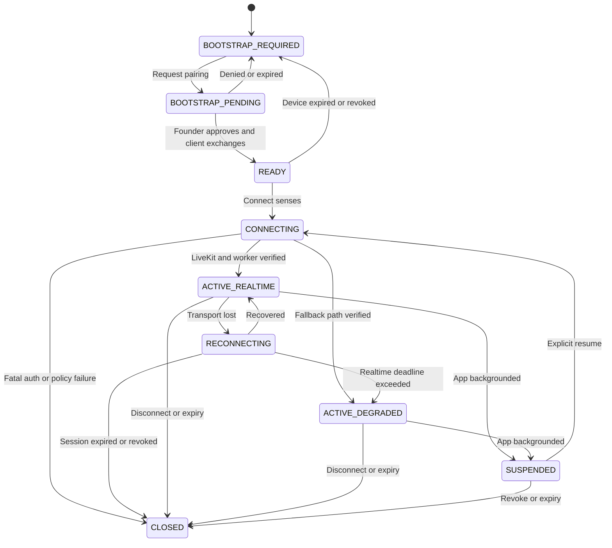
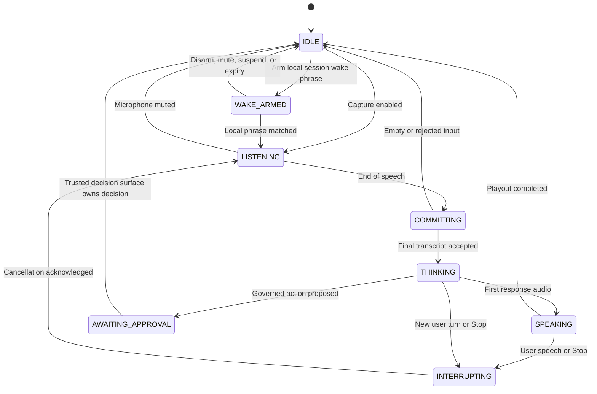
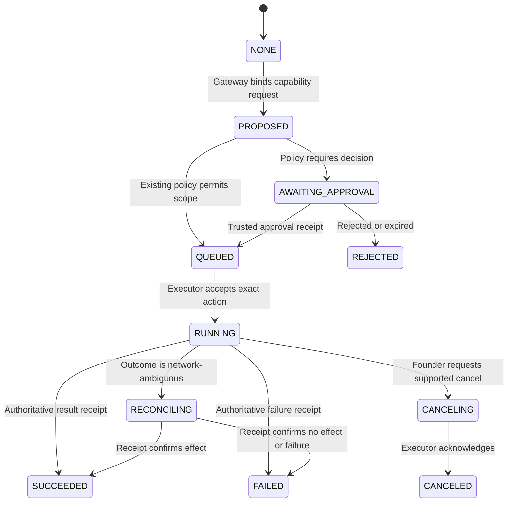

# Aether Senses v1 Interaction Contract

Status: **FOUNDER-APPROVED — FROZEN FOR IMPLEMENTATION**  
Contract version: `aether.senses.interaction.v1`  
Date: 2026-08-07  
Founder: Dee  
Founder decision: **APPROVED** on 2026-08-07 (Asia/Jakarta), recorded in the
project conversation  
Canonical URL: `https://aethers.my.id/senses`  
Proposed SSOT path: `project-docs/foundations/AETHER_SENSES_V1_INTERACTION_CONTRACT.md`  
Baseline reviewed: `kopikonkf/aether-ai-os@81582f70c0ccd3d7b32d364b2be6784cff5ffc31`

## 1. Decision

Aether Senses v1 is the foreground, real-time perception and presence surface
of Aether. It accepts voice, text, camera keyframes, and screen keyframes; it
presents transcript, state, response text, and speech. It does not own
cognition, memory, governance, approval, or tool execution.

Aether Gateway remains the only cognitive authority. LiveKit and browser
speech APIs are replaceable media adapters. AionUi remains the operator and
capability console. Aether Body/MCP runtimes execute only after Gateway policy
and approval.

Senses is not limited to casual voice or visual conversation. It is the
Founder-facing interaction surface through which Dee MAY request any capability
that Aether Gateway truthfully exposes. Browser work, bounded compute, coding,
desktop control, media playback, and external messaging remain capabilities of
the governed execution plane; Senses carries intent, approval/status
presentation, interruption, and results, but never implements or self-grants
those powers.

The experience target is natural, interruptible, visibly stateful conversation
on desktop and an installed mobile PWA. A working static shell, a successful
health response, or source-present media code is not sufficient to claim that
Senses is active.

The normative v1 voice profile is **Aether Mind + exact-text TTS**. Aether
Gateway decides what Aether says. The selected TTS provider decides only how
that already-authorized text is performed. Gemini TTS is the initial primary
candidate for Founder Alpha because it can produce natural, controllable speech
while keeping cognition, memory, governance, and tools inside Aether. Gemini
Live/native audio is a separate experimental profile and is not the v1 Mind.

Normative terms `MUST`, `MUST NOT`, `SHOULD`, and `MAY` are binding within this
contract.

## 2. Canonical surfaces

| Surface | Contract |
|---|---|
| `/senses` | Canonical standalone Senses shell and PWA start URL |
| `/#/senses` | AionUi route that opens or embeds the canonical shell |
| `/api/browser-senses/status` | Public, secret-free readiness and capability status |
| `/aether/api/status` | Gateway status |
| `/health` | Public operational probe |

`/aether/live.html` is non-canonical and MUST NOT receive new functionality.
All sensor use and bootstrap exchange MUST occur in an HTTPS secure context.

## 3. Architectural invariants

1. Every completed cognitive turn MUST be delegated exactly once to Aether
   Gateway. The Senses client, LiveKit worker, browser STT, and browser TTS MUST
   NOT introduce a second answering model.
2. Transport retries MUST NOT duplicate a cognitive turn, approval, tool call,
   or external action. Each turn uses one stable `turn_id` and
   `correlation_id`.
3. Media capability is not authority. Microphone, camera, or screen access
   MUST NOT broaden action scopes or imply approval.
4. The UI MUST distinguish configured, connected, degraded, unavailable, and
   offline states. It MUST NOT label a session `CONNECTED` merely because a
   session record was issued.
5. Raw operator credentials, pairing secrets, participant tokens, and session
   bearer tokens MUST NOT appear in HTML, visible form fields, URLs,
   `localStorage`, logs, receipts, analytics, or error messages.
6. Interim speech transcripts MUST remain ephemeral. Only a final transcript
   may enter a cognitive turn. Final transcript text is governed as normal
   Aether input; raw audio is never retained.
7. Camera and screen capture are denied by default and require modality-specific,
   visible, revocable consent.
8. The v1 voice path MUST use the `GOVERNED_PIPELINE` runtime profile:
   `STT → Aether Gateway → exact authorized speech text → TTS`. A TTS provider
   MUST NOT answer the user, call tools, read or write canonical memory, decide
   approvals, or introduce factual content.
9. Aether Gateway MAY return a separate `speech_text` projection for a response.
   When present, it is the sole authorized spoken payload; otherwise the
   canonical `response_text` is used. Summarization, redaction, and wording
   decisions occur in Gateway before TTS. The TTS adapter may change only
   delivery, never semantic content.
10. Aether's voice character and allowed delivery behavior belong in the
    provider-neutral `voice_profile` of `aether-core/configs/persona.yaml`.
    Provider, model, voice ID, billing tier, quota, and fallback order belong in
    the deployment manifest and MUST NOT become identity or constitutional
    authority.
11. Senses MAY initiate a capability request only by submitting the final
    Founder turn to Gateway. It MUST NOT invoke a local browser, shell, desktop,
    media, messaging, MCP, or runtime-body tool directly. Gateway policy,
    capability routing, approval, execution, and authoritative receipts remain
    mandatory even when the request originated by voice.

### 3.1 Runtime voice profiles

| Profile | v1 disposition | Authority boundary |
|---|---|---|
| `GOVERNED_PIPELINE` | Normative and eligible for every v1 gate | STT produces final text; Gateway owns cognition; exact-text TTS performs the authorized speech payload |
| `NATIVE_AUDIO_EXPERIMENTAL` | Lab-only; not a v1 activation path | Gemini Live or another native audio model may be evaluated as a disposable peripheral but receives no mutation, memory, approval, or canonical-answer authority |

The initial Founder Alpha deployment target is:

```text
microphone
→ LiveKit media, VAD, turn handling, and selected STT
→ Aether Gateway Mind, persona, memory, governance, and tools
→ exact Gateway-authorized speech_text
→ Gemini TTS
→ LiveKit audio playout
```

LiveKit remains media orchestration, not the Mind. STT and TTS are independently
replaceable. Exact provider/model identifiers are deployment facts and do not
require a constitutional or interaction-contract amendment.

### 3.2 Gemini TTS boundary

Gemini TTS is distinct from Gemini Live. It receives bounded text and delivery
instructions and returns audio. It MUST be integrated through the common Aether
TTS adapter or a thin Aether-owned adapter behind the same contract.

For every synthesis request:

1. The provider receives only `speech_text`, the compiled bounded delivery
   instruction, pronunciation entries needed by that text, and technical audio
   parameters.
2. The provider MUST NOT receive the user's raw audio, camera/screen frames,
   tool schemas, tool results, approval objects, canonical-memory records,
   hidden reasoning, operator credentials, or complete conversation history.
3. `speech_text_hash`, persona voice-profile hash, delivery-preset ID,
   provider/model/voice IDs, tier classification, first-audio latency, outcome,
   and audio hash when retained for an audition MUST be receipted.
4. The adapter MUST NOT ask Gemini TTS to rewrite, summarize, translate, answer,
   or improve the payload. Any such transformation is a new Gateway decision.
5. Provider refusal, quota exhaustion, timeout, malformed audio, or fidelity
   failure triggers the declared TTS fallback chain; it never triggers a second
   cognitive answer.

### 3.3 Persona-bound voice shortcut

`persona.yaml` already owns Aether's interaction and expression projection.
v1 extends its existing `voice_profile` with provider-neutral performance
constraints. The target shape is equivalent to:

```yaml
voice_profile:
  character: feminine, warm, youthful-adult, bright, articulate
  language: id-ID
  avoid: childish, shrill, robotic, overly seductive
  delivery:
    default_preset: warm_composed
    accent: natural_indonesian
    code_switching: natural_id_en
    pace: conversational
    allowed_presets:
      - neutral
      - warm_composed
      - technical_clear
      - reassuring
      - urgent_calm
      - playful_light
    expressive_cues:
      policy: structured_allowlist
      allowed:
        - gentle_emphasis
        - softly
        - brief_laugh
        - sigh
        - whisper
      forbidden_contexts:
        - approvals
        - credentials_or_secrets
        - financial_amounts
        - safety_critical_instructions
        - commands_or_code
```

This YAML is the shortcut and policy source, not the literal provider prompt.
A deterministic voice-prompt compiler maps the selected preset to Gemini style,
tone, accent, pace, and optional expressive directions. Runtime code MUST NOT
send the full persona system prompt to TTS.

Gateway MAY attach a structured `delivery_hint` chosen from the allowlist. The
adapter MUST reject unknown hints and use `default_preset`; it MUST NOT infer a
new persona or accept raw provider instructions from browser input. Expressive
cues are control metadata, not part of canonical `speech_text`. Non-verbal cues
are disabled for precision-critical turns and MUST NOT obscure, prepend, append,
or alter the authorized words.

One primary voice ID SHOULD remain locked within an accepted deployment to
preserve recognizable presence. Dee retains audition, selection, lock, veto,
and fallback control. Style may vary through presets; changing to an unaudited
voice requires a new voice audition receipt.

### 3.4 Founder Alpha free-tier decision

The initial Gemini TTS deployment class is `FOUNDER_ALPHA_FREE`. This is an
intentional self-funded validation strategy, not a temporary architecture
exception. Free tier MAY satisfy `WIRED`, `CONFORMED`, `ACTIVE`, and
`FOUNDER-PROVEN` when every corresponding proof passes and Dee accepts the
recorded boundaries. `FOUNDER-PROVEN` proves the Founder experience on the
declared tier; it does not claim commercial or multi-user production capacity.

The following boundaries are mandatory:

- the deployment manifest records `provider`, `model`, `voice`, `billing_tier`,
  current quota/rate-limit class, data-use classification, and fallback order;
- the acceptance UI and packet disclose that the current free-tier provider
  policy may permit submitted synthesis text to be used to improve provider
  products;
- Dee's approval of `FOUNDER_ALPHA_FREE` is recorded explicitly and can be
  revoked without changing Aether's Mind or canonical memory;
- credentials, pairing data, approval codes, private keys, payment details, and
  other secret-class content MUST NOT be sent to a free-tier TTS provider;
- ordinary Founder conversation is permitted under Dee's explicit alpha
  consent, but the runtime exposes an immediate `Private text-only` control that
  suppresses external TTS for the current turn or session;
- quota exhaustion or preview-model instability degrades visibly to the next
  conformed TTS or text output; it MUST NOT cause retry storms or silent charges;
- Aether MUST NOT auto-enable billing, purchase quota, or switch to a paid tier.
  Any paid upgrade requires Dee's explicit authorization.

At the date of this draft, Google's official documentation lists Gemini TTS as
Preview, supports Indonesian and prompt-directed style/tone/accent/pace, and
lists free-tier availability for supported Flash TTS models. These facts MUST be
revalidated at deployment because model names, quotas, pricing, preview status,
and provider data terms are operationally mutable.

When Aether begins generating revenue or the alpha evidence shows quota,
stability, privacy, or latency limits, upgrading the TTS tier or replacing the
provider is a peripheral deployment decision. It MUST NOT require moving
cognition, tools, governance, or memory out of Aether Gateway.

### 3.5 Native audio experimental boundary

Gemini Live or another end-to-end audio model MAY be studied under
`NATIVE_AUDIO_EXPERIMENTAL`, but it MUST NOT:

- receive mutation-capable tools or trusted approval credentials;
- write canonical memory or become the source of canonical response text;
- claim a tool action, approval, or external effect as completed;
- share state with the accepted governed session; or
- contribute evidence toward v1 `ACTIVE` or `FOUNDER-PROVEN`.

Admission beyond lab evaluation requires a separate ADR and conformance
contract proving authority, memory, tool, interruption, receipt, and fallback
behavior. Natural voice quality alone is not sufficient evidence.

### 3.6 Governed capability invocation boundary

This document defines how Senses initiates and presents capability work. It is
not the capability catalog and does not activate a browser, desktop, compute,
media, Telegram, WhatsApp, or other adapter merely by naming it.

The required authority flow is:

```text
voice, text, or consented keyframe
-> Senses final input envelope
-> Aether Gateway Mind and policy
-> capability registry/router
-> GovernedActionPath and trusted approval when required
-> conformed Body, MCP server, or channel adapter
-> authoritative progress/result receipt
-> Gateway response and Senses presentation/TTS
```

The following ownership split is normative:

| Concern | Owning plane | Senses responsibility |
|---|---|---|
| Understand the request and decide whether to propose an action | Aether Gateway Mind | Deliver one final input envelope; show the interpreted summary |
| Discover an eligible capability and adapter | Capability registry/router | Show `available`, `degraded`, or `unavailable` truthfully |
| Bind risk, scopes, exact arguments, target, and approval policy | Governance / `GovernedActionPath` | Show a redacted proposal and approval-required state |
| Approve or reject a governed mutation | Trusted AionUi or Telegram approval surface | Explain and deep-link/status-track only; never decide |
| Execute compute, browser, desktop, media, or messaging work | Conformed Body, MCP server, or channel adapter | Show bounded progress, cancellation, result, and failure |
| Establish what actually happened | Authoritative execution receipt | Present the receipt-backed outcome; never infer success from narration |

Illustrative capability families include:

- bounded compute and coding through a conformed runtime body;
- public observation or governed interaction through a browser adapter;
- play, pause, resume, and stop through a paired-device media adapter;
- Telegram, WhatsApp, email, or future channel messaging through a
  recipient-resolved channel adapter; and
- Windows or other host actions through a platform-specific desktop body.

These examples do not assert source presence, wiring, activation, or Founder
proof. Each adapter MUST have a manifest, least-privilege scopes, credential
boundary, cancellation semantics, conformance receipt, and truthful capability
state. A missing adapter returns `CAPABILITY_UNAVAILABLE`; it MUST NOT be
simulated by the language model.

Read-only, bounded capabilities MAY run without a per-action decision only when
an existing policy explicitly permits the exact scope. External communication,
filesystem or desktop mutation outside pre-authorized bounds, purchases,
credential use, account changes, and destructive actions MUST use
`GovernedActionPath`. For a message send, the approval binding MUST include the
resolved channel, recipient identity, exact body or attachment hashes, and
reply/thread target. A spoken "yes" inside Senses is not a trusted approval.

## 4. Scope and non-goals

### 4.1 Included in v1

- desktop browser and Android installed-PWA operation;
- real-time voice through LiveKit when available;
- the `GOVERNED_PIPELINE` voice profile with Gemini TTS as the initial Founder
  Alpha primary candidate and independently replaceable STT/TTS adapters;
- provider-neutral persona voice presets compiled from `persona.yaml`;
- push-to-talk/browser-STT, typed-text, browser-TTS, and text-only fallbacks;
- single-frame and bounded-interval camera vision;
- single-frame and bounded-interval screen vision;
- user barge-in and explicit stop;
- a generic capability-request, approval-status, progress, cancellation, and
  result presentation contract for work executed by governed capability planes;
- an optional, explicitly armed, foreground and session-scoped local wake
  phrase;
- platform-mediated user verification that discloses no biometric material to
  Aether;
- affective expression and ephemeral contextual empathy within the boundaries
  below;
- device pairing without exposing an operator token;
- latency, transition, privacy, and fallback receipts.

### 4.2 Deferred from v1 acceptance

- ambient or background wake-word operation while Senses is closed, suspended,
  or backgrounded;
- background microphone, camera, or screen capture;
- autonomous visual monitoring or surveillance;
- a 3D avatar or entertainment animation as an acceptance dependency;
- native Android APK behavior beyond the installable PWA; and
- multi-founder or public-user identity.

A foreground, explicitly armed, session-scoped wake phrase MAY be implemented.
It MUST be detected locally, MUST NOT transmit pre-wake audio, and MUST stop when
Senses is backgrounded, suspended, muted, disconnected, closed, or expired.
Session wake is an optional enhancement, not a v1 acceptance dependency.

### 4.3 Identity, sensing, and affect boundaries

Aether MUST NOT perform or store face recognition, voiceprint identity,
biometric templates, biometric emotion recognition, or persistent inferred
emotion profiles in v1. Camera access for consented perception MUST NOT be
repurposed for identity or affect classification.

Platform-mediated user verification such as WebAuthn, passkeys, Windows Hello,
or Android biometric authentication MAY be used when Aether receives only the
signed authentication result and associated public protocol metadata. Aether
MUST NOT receive or retain a face image, fingerprint, voiceprint, platform
biometric template, or raw biometric sensor output.

Senses MAY adapt delivery through `AFFECTIVE_EXPRESSION` and
`CONTEXTUAL_EMPATHY` using explicit conversational meaning and ephemeral task
context. This adaptation MUST NOT establish identity, authorize an action,
diagnose a psychological condition, create a persistent emotional profile, or
silently change the canonical response. Any inferred conversational cue expires
with the turn or session and is not canonical memory unless Dee explicitly
states a durable preference as ordinary content.

### 4.4 Permanent governance prohibitions

- voice, face, inferred emotion, or a wake phrase MUST NOT approve an action or
  broaden an authority scope;
- Gemini Live or another native-audio model MUST NOT become the canonical v1
  Mind or accepted v1 voice path;
- a sensor, presentation surface, or capability adapter MUST NOT become
  identity, memory, policy, or approval authority; and
- narration, animation, TTS output, or client-side state MUST NOT be treated as
  proof that an external action completed.

### 4.5 Capability claim boundaries

Senses v1 includes the governed capability handoff and action-lifecycle UX; it
does not require every conceivable capability adapter to be active. Browser
control, compute, coding, desktop-machine control, media playback, Telegram or
WhatsApp sending, and future tools each require their own implementation,
credential policy, conformance proof, host wiring, and Founder acceptance.

A Senses acceptance packet proves only the interaction and handoff behavior it
actually exercises. It MUST NOT claim a named capability `ACTIVE` unless the
referenced adapter has its own current conformance and host-execution receipt.
Likewise, a successful Founder Alpha free-tier run MUST NOT be used to claim
commercial, public, or multi-user capacity.

## 5. Interaction state machines

Authentication/session transport, conversational turn, sensor consent, and
capability execution are orthogonal machines. A single overloaded `connected`,
`thinking`, or `working` boolean is forbidden.

### 5.1 Authentication and session state



| State | Required user-visible meaning |
|---|---|
| `BOOTSTRAP_REQUIRED` | `Hubungkan perangkat` |
| `BOOTSTRAP_PENDING` | `Menunggu persetujuan Dee` plus expiry countdown |
| `READY` | Authenticated; no sensor is active |
| `CONNECTING` | Negotiating transport; no claim that Aether can hear |
| `ACTIVE_REALTIME` | `LIVE` only after microphone track, worker, Gateway turn path, and audio output are verified |
| `ACTIVE_DEGRADED` | Exact active fallback label, such as `VOICE FALLBACK` or `TEXT ONLY` |
| `RECONNECTING` | Input state is preserved locally; uncertain turns are not replayed automatically |
| `SUSPENDED` | All capture stopped because the app is not foregrounded |
| `CLOSED` | Credentials/session closed, expired, or revoked; all tracks stopped |

The existing server lifecycle values `ISSUED`, `CONNECTING`, `ACTIVE`,
`DEGRADED`, `CLOSED`, and `EXPIRED` remain authoritative. The client states
above refine their presentation. `ACTIVE_REALTIME` maps to server `ACTIVE`;
`ACTIVE_DEGRADED` maps to server `DEGRADED`.

### 5.2 Conversational turn state



Rules:

- Only one authoritative user turn may be open per Senses session.
- `WAKE_ARMED` is optional, foreground-only, locally detected, visibly
  indicated, and transmits no pre-wake audio.
- Partial transcripts MAY be displayed but MUST NOT be sent to cognition.
- `THINKING` begins only after a final transcript or explicit text/vision
  submission is accepted by Gateway.
- `SPEAKING` begins on first audible output, not when TTS was requested.
- Approval remains owned by a trusted approval surface. Voice may explain an
  approval request but MUST NOT silently approve it.
- Every terminal or interrupted turn MUST emit a redacted receipt.

### 5.3 Capability execution state

Conversational completion and action completion are different. Aether may
finish speaking while a governed action remains pending or running.



Rules:

- every proposal uses a stable `action_id`, `correlation_id`, capability name,
  exact-action hash, policy decision, and selected adapter manifest hash;
- Senses MUST render a safe action summary, current authoritative state,
  approval requirement, bounded progress, cancel availability, and final
  receipt ID without exposing credentials or raw executor commands;
- a mutation in `RECONCILING` MUST NOT be resubmitted automatically;
- interruption of Aether's speech does not cancel an action; action cancellation
  requires a distinct control bound to the exact `action_id`;
- `SUCCEEDED` is permitted only after an authoritative execution receipt, never
  because the model narrated success; and
- a capability that is absent, disabled, unconformed, unhealthy, out of scope,
  or credential-unavailable fails visibly before execution and MUST NOT be
  disguised as a conversational success.

## 6. Authentication bootstrap without raw operator token

### 6.1 Required experience

The Senses page MUST NOT render a founder/operator token input. An unpaired
device requests pairing; Dee receives an approval card in the already trusted
AionUi Approval Inbox or Telegram inline approval flow. The card shows the
human confirmation code, requested capabilities, device label, PWA/browser
mode, time, and approximate network origin. Approval is one-tap but explicit.

### 6.2 Bootstrap protocol

The following v1 routes are frozen as the target contract:

| Route | Authentication | Purpose |
|---|---|---|
| `POST /api/browser-senses/bootstrap/requests` | Public, rate-limited | Create pending pairing request |
| `POST /api/browser-senses/bootstrap/requests/{bootstrap_id}/status` | Client proof | Poll pending/approved/denied/expired state |
| `POST /api/browser-senses/bootstrap/requests/{bootstrap_id}/exchange` | One-time verifier plus device signature | Establish paired device credential |
| `POST /api/browser-senses/bootstrap/requests/{bootstrap_id}/decision` | Existing trusted operator channel | Approve or deny once |
| `DELETE /api/browser-senses/devices/{device_id}` | Existing trusted operator channel | Revoke a paired device and its sessions |

Protocol requirements:

1. The browser creates a non-exportable P-256 device key with WebCrypto and a
   random 256-bit verifier. Only the public key and verifier hash leave the
   device before approval.
2. A pairing request expires after 120 seconds. Its human confirmation code is
   for matching the approval card; it is not the authentication secret.
3. The decision endpoint is unavailable to the requesting untrusted session.
   Approval MUST arrive through an already authenticated AionUi or Telegram
   operator path.
4. Exchange is single-use, origin-bound to `https://aethers.my.id`, and requires
   both verifier proof and a signature by the submitted device key.
5. Successful exchange sets a `__Host-aether_device` cookie with `Secure`,
   `HttpOnly`, `SameSite=Strict`, `Path=/`, and no `Domain`. The paired device
   credential has a 30-day absolute lifetime and a 7-day idle lifetime. Dee can
   revoke it at any time.
6. Each Senses connection uses a signed server nonce to prove possession of the
   device key and creates a separate one-hour browser-sense session. The session
   is represented by a `__Host-aether_senses` cookie with the same cookie
   protections and a maximum 15-minute idle timeout while not actively
   connected.
7. JavaScript receives only public session metadata and a memory-only CSRF
   nonce. The current `browser_session_token` MUST move behind the HttpOnly
   session boundary before v1 acceptance.
8. Bootstrap request creation is limited to 5 attempts per source per 10
   minutes and 30 attempts globally per hour. Decisions and exchanges are
   append-only, replay-safe, and audit-receipted without secrets.
9. Denial, expiry, device revocation, session close, and credential expiry MUST
   stop all tracks and invalidate all subordinate LiveKit grants.

The same-origin boundary MUST enforce CORS denial by default, exact Origin and
Fetch-Metadata validation for state-changing requests, and the memory-only CSRF
nonce. Authentication and bootstrap responses use `Cache-Control: no-store`.
The Senses shell uses a restrictive CSP with self-hosted scripts, an explicit
LiveKit `connect-src`, `frame-ancestors 'self'` for the same-origin AionUi route,
`Referrer-Policy: no-referrer`, and a Permissions Policy limited to same-origin
microphone, camera, and display capture.

If persistent WebCrypto key storage is unavailable, v1 MAY offer session-only
pairing. It MUST NOT fall back to asking the user to type the raw operator
token into Senses.

### 6.3 Platform-mediated user verification

A paired device MAY require WebAuthn user verification before opening a Senses
session or before handing Dee to a trusted high-risk approval surface. The
authenticator and operating system own biometric handling. Gateway receives a
standards-based signed assertion, origin and challenge binding, credential ID,
counter or equivalent replay signal, and a user-verification result only.

Platform verification proves presence of the enrolled platform user; it does
not itself approve a governed action. Aether MUST NOT request, expose, log, or
store platform biometric enrollment data or raw sensor output. Failure or
unavailability falls back to another explicit authenticator or session-only
pairing, never to face recognition implemented by Senses.

## 7. Latency contract

Latency is measured with client monotonic time and correlated Gateway/worker
receipts. Permission-prompt dwell time is reported separately and excluded from
the warm-path percentiles. Provider, transport, device class, mode, and fallback
path are recorded without content or secrets.

| Measure | Start → end | v1 target |
|---|---|---:|
| Warm shell usable | navigation start → controls usable | p95 ≤ 1.5 s |
| Cold shell usable | navigation start → controls usable | p95 ≤ 3.0 s |
| Warm voice connection | Connect gesture → `LISTENING`, permissions already granted | p50 ≤ 2.0 s; p95 ≤ 5.0 s |
| State feedback | authoritative event → visible state | p95 ≤ 100 ms |
| Partial transcript | speech onset → first partial text | p95 ≤ 450 ms |
| STT finalization | detected speech end → final transcript | p95 ≤ 900 ms |
| Cognition response start | final transcript accepted → first response text | p50 ≤ 1.2 s; p95 ≤ 3.0 s |
| TTS first audio | synthesis accepted → first playable audio frame | p50 ≤ 800 ms; p95 ≤ 1.8 s |
| Natural voice response | detected speech end → first audible response | p50 ≤ 2.0 s; p95 ≤ 4.5 s; max ≤ 8.0 s |
| Barge-in silence | confirmed user speech onset → prior audio silent | p95 ≤ 200 ms; hard ceiling 350 ms |
| Explicit Stop | button/keyboard event → prior audio silent | p95 ≤ 120 ms; hard ceiling 250 ms |
| Vision response start | capture confirmation → first response text | p95 ≤ 5.0 s; max ≤ 10.0 s |
| Degraded-mode decision | confirmed dependency failure → fallback label usable | p95 ≤ 3.0 s |
| Reconnect | network restored → usable mode | p95 ≤ 8.0 s |
| Action state feedback | authoritative capability event → visible state | p95 ≤ 250 ms |
| Action cancel request | cancel gesture → executor request accepted or unsupported shown | p95 ≤ 500 ms |

The UI SHOULD expose perceived progress before 300 ms. Crossing a target does
not authorize a second model or unsafe retry. If a dependency cannot meet the
budget, Senses degrades honestly.

The active Gemini TTS transport MAY use provider streaming directly or a
LiveKit plugin when that exact plugin/model combination meets this budget and
cancellation contract. A non-streaming integration is not rejected merely for
being non-streaming; it fails conformance only if observed first-audio,
interruption, memory, or resource behavior misses the contract. Exact transport
and streaming capability are recorded in the deployment manifest and
acceptance packet.

## 8. Interruption semantics

### 8.1 Barge-in

When the authenticated local participant begins speaking during `SPEAKING`,
Senses MUST:

1. confirm speech with VAD while rejecting short non-speech noise;
2. stop or duck current playout within the latency budget;
3. cancel queued TTS frames, close or cancel the provider synthesis stream when
   supported, and invalidate the synthesis generation so late audio is dropped;
4. mark the assistant turn `interrupted=true` with reason `user_barge_in` and
   delivered-audio duration when available;
5. increment the turn generation so late packets cannot resume old audio;
6. enter `LISTENING` and treat the new final transcript as a new turn.

An interrupted response MUST NOT resume automatically. If upstream cognition
cannot be canceled, its late result is receipted and discarded from playout.

### 8.2 Explicit stop and competing input

- A persistent `Stop Aether` control and the `Escape` key MUST immediately stop
  browser and LiveKit audio.
- Sending typed text during `THINKING` or `SPEAKING` interrupts the prior
  conversational response before creating the new turn.
- Muting the microphone stops capture but does not disconnect the session.
- Disconnecting closes the session, stops every local track, clears timers,
  cancels browser speech APIs, disconnects LiveKit, and invalidates grants.
- Interruption of speech does not necessarily cancel an already committed
  external action. The UI MUST show the action's authoritative governance state.
- No interruption gesture counts as approve or reject.

### 8.3 Network ambiguity

If connectivity fails after a turn may have reached Gateway, Senses MUST NOT
automatically replay it. The client queries by `turn_id`; if completion cannot
be proven, it displays `Turn not confirmed—tap to retry` and requires an
explicit retry with a new turn ID linked to the prior uncertain ID.

### 8.4 Foreground session wake phrase

If implemented, `SESSION_WAKE` starts only after Dee opens and authenticates
Senses, grants microphone permission, and explicitly selects `Arm wake phrase`.
The detector runs on the client device and emits only the match event; no
pre-wake waveform or transcript is sent to LiveKit, Gateway, analytics, memory,
or receipts. The microphone indicator and `WAKE ARMED` state remain visible.

A match transitions to normal `LISTENING`. After the current turn, deployment
policy MAY return to `WAKE_ARMED` while the session remains foregrounded. Mute,
disarm, background, screen lock, suspension, transport close, credential
expiry, or session expiry stops detection immediately. Wake matching proves
only user intent to begin listening and grants no identity or action authority.

## 9. Vision and screen consent

### 9.1 Consent boundaries

Camera permission, local preview, and Aether vision are three separate states:

- `CAMERA_OFF`: no camera track;
- `PREVIEW_LOCAL`: local preview only; zero frame or video transmission;
- `VISION_ONE_SHOT`: one confirmed frame submitted;
- `VISION_BOUNDED`: one keyframe every 15 seconds under a visible consent lease.

Screen share follows the same separation and uses a distinct browser permission
and a distinct `SCREEN_*` indicator. Camera consent never grants screen consent,
and vice versa.

### 9.2 Required behavior

1. Camera, screen share, and bounded vision default to off on every new session.
2. Enabling preview MUST NOT publish a continuous camera or screen video track
   to LiveKit. v1 cognition accepts only explicit or bounded keyframes.
3. One-shot capture requires an explicit `Ask what you see` or equivalent user
   action and a visible capture flash/badge.
4. Bounded vision uses a fixed 15-second interval and a 15-minute consent lease.
   The UI shows `VISION ACTIVE`, source, interval, last capture, and countdown.
   Renewal requires a user gesture.
5. Bounded capture stops immediately on camera/screen stop, session disconnect,
   credential expiry, browser backgrounding, screen lock, permission loss, or
   capture error.
6. The server MUST validate the session capability, consent ID, source type,
   byte limit, MIME type, capture timestamp, and monotonic sequence number.
7. Raw keyframes are working data only. They MUST be deleted immediately after
   the vision turn reaches a terminal state. A crash sweeper MUST delete any
   orphaned raw frame within five minutes. Persistent evidence contains only
   content hash, byte count, dimensions, source, consent ID, timestamps,
   provider/model IDs, correlation ID, and outcome.
8. Raw audio and video MUST NOT enter event logs, analytics, or text memory.
   Aether's textual observation and response may enter governed text memory.
9. v1 MUST NOT perform face recognition, identity matching, biometric storage,
   biometric affect inference, or persistent emotional profiling. Explicit
   conversational meaning may guide ephemeral contextual empathy under Section
   4.3.

## 10. Mobile and PWA behavior

### 10.1 Tier-1 targets

- current stable Chromium on Windows desktop;
- current stable Chrome on Android, both browser-tab and installed-PWA modes.

Responsive iOS Safari operation is `SHOULD`; it is not a v1
`FOUNDER-PROVEN` gate unless Dee designates an iOS device as Tier 1.

### 10.2 Installable shell

The PWA MUST provide a same-origin manifest with `start_url: /senses`, scope
limited to Senses, standalone display, complete icons, theme/background colors,
safe-area handling, portrait-first layout, landscape support, and minimum
44-by-44 CSS-pixel primary touch targets.

The LiveKit client and other production dependencies MUST be pinned and bundled
at build time. Runtime import from a public CDN is prohibited for v1.

The service worker MAY cache only versioned static shell assets. It MUST NOT
cache API responses, health/status responses, transcripts, conversation text,
audio, video, frames, authentication responses, cookies, or tokens. An offline
launch displays the cached shell with `OFFLINE — Aether unavailable`; it does
not fabricate a response.

### 10.3 Foreground-only sensor policy

v1 sensors operate only while Senses is visible and foregrounded. On
`visibilitychange` to hidden, page freeze, app switch, or screen lock, the client
MUST within one second:

- stop camera and screen tracks;
- stop bounded vision timers;
- mute/stop microphone capture;
- disarm and stop any local session-wake detector;
- cancel local speech recognition and speech synthesis;
- enter `SUSPENDED`.

Returning to the foreground shows an explicit `Resume senses` action. Sensors
MUST NOT restart without that gesture. Network changes preserve the text draft
but never queue audio, images, or uncertain cognitive turns for automatic
replay.

## 11. Degraded-mode contract

Senses chooses the highest verified mode, not the highest configured mode.

| Mode | Input | Output | Behavior and limits |
|---|---|---|---|
| `FULL_REALTIME` | Live microphone/STT, text, keyframes | Conformed TTS audio plus text | Full-duplex voice and barge-in; requires LiveKit room, worker, Gateway, STT, and TTS proof |
| `VOICE_FALLBACK` | User-initiated browser STT or push-to-talk, text, keyframes | Browser TTS plus text | Half-duplex; explicit Stop is required; MUST NOT claim full-duplex barge-in |
| `TEXT_SPEECH` | Typed text and keyframes | Browser TTS plus text | Used when STT is unavailable |
| `TEXT_ONLY` | Typed text and keyframes when vision works | Text | Used when audio input/output is unavailable |
| `STATUS_ONLY` | Health/retry controls | Status only | Gateway cognition unavailable; no alternate model response |
| `OFFLINE` | Local UI controls only | Cached status copy | No network; no send, capture, cognition, or queued replay |

Vision availability is an independent capability flag. A voice mode may show
`VISION UNAVAILABLE` without unnecessarily disabling voice or text.

Execution capabilities are also independent flags. A healthy voice session
MUST show a browser, compute, desktop, media, or messaging capability as
`UNAVAILABLE` or `DEGRADED` when its own adapter is not currently eligible; it
MUST NOT downgrade the entire conversation or pretend the capability exists.

External speech privacy is also an independent flag. `PRIVATE TEXT-ONLY` means
Gateway cognition remains available while external TTS is suppressed by the
Founder. It MUST NOT be represented as a provider failure or silently reset at
the next turn.

Additional rules:

- Fallback MUST be visible, receipted, and reversible after live recovery.
- A provider fallback inside STT, cognition, or TTS records primary failure
  class, selected fallback, latency, and outcome without exposing credentials.
- The initial TTS order is deployment-configured and MAY start with Gemini TTS
  free tier. Each next provider must already be conformed; otherwise output
  degrades to browser speech or text. Browser speech is labeled as a lower
  quality fallback and never masquerades as the accepted Aether voice.
- Free-tier quota/rate-limit errors open a bounded cooldown circuit and advance
  the fallback chain. No automatic paid request or billing change is allowed.
- Invalid requests, authentication failures, policy denials, and unknown
  failure classes fail closed; they are not fallback triggers.
- Reconnect uses jittered backoff and stops automatic attempts after 60 seconds.
- A downgrade never broadens capabilities or reuses stale consent.
- A text response remains authoritative if TTS fails; Senses MUST NOT regenerate
  different wording solely for speech.

## 12. Receipts and observability

The client, Gateway, and worker MUST correlate the following timestamps and
outcomes by session and turn ID:

- session issued, connecting, active/degraded, suspended, closed, expired;
- media track published, muted, stopped, or lost;
- speech onset/end, first partial, final transcript;
- Gateway accepted, first response text, completed/canceled;
- speech-text hash, persona voice-profile hash, delivery preset/cue IDs, and
  pronunciation-lexicon version;
- TTS provider/model/voice/tier, transport/streaming mode, request accepted,
  first/last audio, interruption request, provider canceled, audio stopped;
- TTS fallback trigger class, circuit state, selected fallback, and outcome;
- consent granted/revoked/expired and frame accepted/deleted;
- provider/fallback selection and normalized error class;
- authentication bootstrap requested/approved/denied/exchanged/replayed/revoked;
- platform user-verification requested/succeeded/failed without biometric data;
- session wake armed/matched/disarmed and the reason it stopped, without audio;
  and
- capability proposed, policy-decided, approval-linked, queued, running,
  progress-updated, cancel-requested, reconciling, and terminal, correlated by
  `action_id` and exact-action hash.

Receipts use wall-clock UTC for cross-process correlation and monotonic deltas
for latency. They MUST NOT contain raw media, partial transcript, operator token,
pairing verifier, cookie, bearer token, LiveKit grant, or complete device public
fingerprint. Device and network identifiers are salted hashes.

Receipts MUST NOT persist the compiled Gemini director prompt or `speech_text`
body. Their hashes and approved preset IDs are sufficient. Audition audio MAY be
retained only in the explicit voice-audition artifact boundary; ordinary Senses
audio is never retained.

## 13. Founder acceptance criteria

`FOUNDER-PROVEN` for Senses v1 requires all automated evidence below plus Dee's
explicit attestation. Source merge alone can establish only `IMPLEMENTED`.

### 13.1 Required test matrix

| Proof group | Minimum evidence |
|---|---|
| Public surface | All five canonical routes succeed through public HTTPS; non-canonical URL is not used by UI |
| Authentication | Approve, deny, expiry, replay rejection, device revocation, and session expiry are demonstrated without typing/exposing operator token |
| Platform verification | When enabled, signed user verification succeeds and fails safely while inspection proves Aether receives no raw biometric material; absence is declared rather than replaced with face recognition |
| Desktop | 15 successful voice turns on Tier-1 Windows browser, including text and one-shot vision |
| Mobile/PWA | Install, cold launch, warm launch, and 15 successful voice turns on Tier-1 Android PWA |
| Voice architecture | Receipts prove every accepted voice turn used `GOVERNED_PIPELINE`; TTS received only the authorized payload and no native-audio model became a second Mind |
| Voice fidelity | A fixed 40-utterance suite covers Indonesian, Indonesian-English code-switching, names, acronyms, numbers, dates, currency, paths, and technical terms; no material addition, omission, or substitution |
| Persona and comfort | Dee completes blind audition plus one continuous 30-minute session and scores naturalness, warmth, articulation, persona fit, and listening comfort |
| Gemini free tier | Manifest, quota failure drill, provider-data disclosure, explicit Dee alpha consent, secret-class suppression, `Private text-only`, and fallback are demonstrated |
| Interruption | 20 barge-in trials and 10 explicit-stop trials; no canceled audio resumes and no turn is duplicated |
| Vision | 5 one-shot camera frames, one 15-minute-or-manually-ended bounded session, and 3 screen keyframes; preview-only proves zero transmission |
| Privacy | Background/screen-lock sensor stop, consent expiry, normal frame deletion, crash-sweeper deletion, and secret/cache inspection pass |
| Session wake, when shipped | 20 foreground wake matches plus false-positive, mute, background, lock, disconnect, and expiry trials; zero pre-wake audio/transcript leaves the device |
| Identity and affect | No face/voiceprint/biometric-affect path exists; contextual-empathy trials prove cues are ephemeral, non-authoritative, and absent from persistent emotional profiles |
| Degradation | Deliberate LiveKit, STT, TTS, vision, Gateway, and network failures reach the correct mode without a second cognition path |
| Capability handoff | One bounded read-only capability, one approval-required mutation, one rejection, one unavailable capability, one supported cancellation, and one network-ambiguous reconciliation traverse the action state machine |
| Governance | The approval-required action remains pending until decided in a trusted surface; voice, wake, biometrics, inferred affect, and interruption cannot approve it |
| Exactly once | Network ambiguity/retry test proves no duplicate cognitive turn or external action |

### 13.2 Quantitative pass conditions

- At least 30 clean voice turns are measured across desktop and mobile.
- All accepted turns prove `GOVERNED_PIPELINE`; zero TTS request contains raw
  audio, image/frame bytes, tool/approval objects, memory records, secrets, or
  complete conversation history.
- The 40-utterance fidelity suite has zero critical semantic discrepancy.
  Amounts, dates, times, negation, names, approval language, and technical
  identifiers require 100% correct spoken meaning. Minor accent differences may
  pass only when intelligibility and meaning are unaffected and Dee accepts the
  recorded pronunciation.
- Dee scores naturalness, warmth, articulation, persona fit, and 30-minute
  listening comfort at least 4 of 5 each. Any robotic, childish, shrill, or
  overly seductive tendency that Dee marks materially uncomfortable fails the
  voice candidate regardless of aggregate score.
- Every precision-critical turn proves expressive cues were suppressed. Every
  tested delivery preset preserves the authorized words and the locked voice
  identity.
- Natural voice response and connection p95 meet Section 7; no clean turn exceeds
  the stated maximum.
- At least 95% of barge-in trials meet 200 ms and every trial meets 350 ms.
- Every explicit-stop trial meets 250 ms.
- At least 95% of vision trials begin a response within 5 seconds and every
  trial completes or fails visibly within 10 seconds.
- Session/turn UI state matches authoritative receipts for every acceptance
  trial.
- Every capability trial's visible state matches its authoritative action
  receipt; zero mutation is retried while `RECONCILING`, and zero client or
  model narration is accepted as proof of completion.
- Zero raw operator tokens, bearer tokens, participant grants, audio, video, or
  frame bytes appear in persistent logs, caches, or acceptance packets.
- Zero raw biometric material, biometric templates, pre-wake audio/transcripts,
  or persistent inferred-emotion profiles are created or retained.
- Zero duplicate Gateway turns, approvals, tool calls, or external actions.
- Free-tier quota exhaustion reaches the declared fallback without a retry storm,
  hidden charge, cognitive regeneration, or loss of the authoritative text.

### 13.3 Acceptance artifact

The host MUST write:

```text
$AETHER_HOME/runtime/senses/latest_acceptance_packet.json
$AETHER_HOME/runtime/senses/acceptance_runs/<run_id>.json
$AETHER_HOME/runtime/senses/acceptance_runs/<run_id>.jsonl
```

The packet includes contract version, exact Git commit, host and browser/PWA
versions, redacted configuration, test counts, percentile metrics, degraded-mode
drills, privacy checks, referenced receipt hashes, unresolved boundaries, and
Dee's decision. It also records platform-verification disposition, session-wake
disposition when shipped, the capability families actually exercised, selected
adapter manifest hashes, action-state test outcomes, and referenced action
receipts. Voice evidence additionally includes runtime profile,
provider/model/voice, billing tier, provider terms snapshot date, data-use
classification, voice-profile and compiler hashes, fallback order, streaming
mode, fidelity suite results, persona scores, discomfort notes, and Dee's
`FOUNDER_ALPHA_FREE` consent/disposition. It contains no transcript text, raw
media, compiled provider prompts, or secrets.

The Senses criterion in the existing Founder Acceptance packet MUST reference
this packet hash. Public health alone is insufficient. Only Dee may record the
final Senses disposition:

- `accepted`;
- `accepted_with_explicit_boundaries`; or
- `rejected`.

Until that record exists, the truthful state remains `ACTIVE` at most and
`FOUNDER-PROVEN: NO`.

### 13.4 Founder Alpha voice disposition

The purpose of `FOUNDER_ALPHA_FREE` is to expose real defects and comfort limits
before Dee funds a higher-capacity peripheral. The acceptance packet therefore
ends with exactly one voice disposition:

- `continue_free`: quality and reliability are acceptable inside the recorded
  alpha quota and privacy boundaries;
- `continue_free_with_fallback_boundary`: acceptable when a named fallback and
  its visible quality difference remain explicit;
- `replace_model_or_voice`: architecture passes but the auditioned performance
  does not fit Aether;
- `upgrade_paid_tier`: the same governed architecture passes, but measured
  quota, stability, privacy, latency, or support needs justify paid capacity;
- `reject_voice_path`: a semantic, safety, privacy, or persistent comfort defect
  makes the candidate unsuitable.

Critical rejection conditions include material word mutation, incorrect
negation/amount/date/approval language, secret transmission, an uncontrolled
billing transition, recurring voice identity drift, canceled audio resuming,
or a voice characteristic Dee finds persistently uncomfortable. An upgrade is
evidence-triggered and Founder-authorized; revenue availability alone does not
force a provider change.

## 14. Current-main implementation delta

The reviewed baseline provides a strong scaffold but does not conform to this
v1 contract yet.

| Current behavior | Required change before v1 acceptance |
|---|---|
| Senses asks for `Founder/operator token` | Remove the field and implement trusted pairing bootstrap |
| Browser session bearer is exposed to JavaScript memory | Move session authority to protected same-origin cookie boundary |
| UI uses a single online/offline presentation | Implement the orthogonal session, turn, mode, consent, and capability-action states |
| Senses has no generic receipt-backed capability proposal/progress/result surface | Add the Gateway-only invocation handoff, safe action cards, trusted-approval linkage, cancellation, reconciliation, and authoritative result presentation |
| ADR-0051 MCP baseline is projection-only and read-only | Do not treat it as desktop/tool activation; add mutation capabilities only through separate governed adapter contracts and conformance |
| No foreground session-wake implementation is proven | Keep it optional; if shipped, implement local-only detection, visible arming, lifecycle shutdown, and conditional tests |
| No platform-mediated WebAuthn/biometric boundary is proven | Add signed assertion handling if selected; never implement Senses-owned face or voice recognition |
| LiveKit client is imported from jsDelivr at runtime | Pin and bundle it in the release |
| Worker defaults to Deepgram STT and Cartesia TTS; Gemini TTS is not the accepted runtime path | Add Gemini TTS behind the common exact-text adapter, manifest, fallback, and receipts; retain provider reversibility |
| `persona.yaml` has a coarse `voice_profile` only | Add provider-neutral delivery presets/cues and a deterministic bounded prompt compiler; keep model/voice/tier out of persona identity |
| No explicit `GOVERNED_PIPELINE` versus `NATIVE_AUDIO_EXPERIMENTAL` runtime gate | Enforce the profile in session metadata and reject native-audio authority from v1 conformance |
| No free-tier data/quota declaration or private speech suppression | Add `FOUNDER_ALPHA_FREE`, explicit consent, secret-class blocking, `Private text-only`, circuit breaking, and tier receipts |
| Enabling camera publishes a continuous LiveKit video track | Keep preview local; submit only consented keyframes in v1 |
| Vision frames are written under `AETHER_HOME/senses/frames` without proven deletion | Delete after terminal turn and add five-minute orphan sweeper |
| `VisionFrameReceipt` requires a persistent storage reference | Represent an ephemeral handle plus deletion outcome without requiring retained media |
| LiveKit-unavailable path can visually claim connected without marking server degraded | Record `DEGRADED` and render the exact fallback mode |
| No explicit barge-in/cancel receipt contract | Add turn-generation cancellation and interruption evidence |
| Bounded vision has no expiring consent lease | Add consent ID, countdown, expiry, and background revocation |
| Screen-share capability exists without v1 UI behavior | Add separate local-preview/keyframe consent path or declare it unavailable |
| No installable Senses PWA/service-worker contract | Add manifest, bundled assets, safe cache policy, and foreground suspension |
| Existing founder acceptance checks public Senses health only | Require the Senses acceptance packet and packet hash |

## 15. Conformance gates

| Gate | Meaning for this contract |
|---|---|
| `IMPLEMENTED` | State/auth/consent/mode/action contracts, governed voice profiles, capability handoff UI, persona compiler, endpoints, PWA, receipts, and deterministic tests are source-present |
| `WIRED` | Production origin, pairing approval channel, LiveKit worker, declared STT/TTS tier and fallback, Gateway, and receipt paths are configured on the Founder host |
| `CONFORMED` | Automated contract tests and host privacy/failure drills pass against the exact release commit |
| `ACTIVE` | Real desktop and mobile sessions complete credentialed governed voice, interruption, vision, capability handoff, and degraded recovery proofs on the declared tier |
| `FOUNDER-PROVEN` | Dee signs the hash-bound Senses acceptance packet, including the voice/tier boundaries actually tested |

No lower gate implies a higher gate.

## 16. Founder review defaults

Unless Dee changes them before this draft becomes accepted, v1 freezes these
defaults:

1. Tier-1 mobile target: Android Chrome installed PWA; iOS remains Tier 2.
2. Paired-device lifetime: 30 days absolute, 7 days idle; Senses session:
   1 hour absolute and 15 minutes idle while disconnected.
3. Sensors are foreground-only. Returning from background always requires an
   explicit Resume gesture.
4. Bounded vision: one keyframe every 15 seconds with a 15-minute consent lease.
5. v1 transmits keyframes only—never continuous camera or screen video to
   cognition.
6. Voice runtime: `GOVERNED_PIPELINE`; Aether Gateway remains the Mind and TTS
   remains an exact-text expression peripheral.
7. Initial primary TTS candidate and tier: Gemini TTS under
   `FOUNDER_ALPHA_FREE`, subject to audition and runtime conformance. A failed
   candidate does not amend the architecture; it activates the declared
   fallback or another audition.
8. Voice identity is bound by provider-neutral `persona.yaml` constraints; the
   accepted provider model and one primary voice ID are pinned in the deployment
   manifest and acceptance packet.
9. Free tier may reach `FOUNDER-PROVEN` for the founder-only alpha. It does not
   establish commercial, public, or multi-user production capacity.
10. Ambient/background wake is deferred. A local, visibly armed, foreground
    `SESSION_WAKE` MAY ship but is not an acceptance dependency.
11. Aether receives signed platform user-verification results only; it performs
    no face recognition, voiceprint identity, or biometric affect inference.
12. Affective expression and ephemeral contextual empathy are allowed; inferred
    emotional profiling, psychological claims, and affect-based authority are
    forbidden.
13. Senses is the conversational capability-request and result surface. Named
    browser, compute, coding, desktop, media, or messaging capabilities are
    claimed independently only after their own adapter conformance and host
    proof.

## 17. Source alignment

This contract extends, and does not replace, the following SSOT decisions:

- `project-docs/adr/ADR-0041-unified-browser-senses.md`;
- `project-docs/adr/ADR-0051-mcp-capability-plane-baseline.md`;
- `project-docs/deployment/CLOUDFLARE_INGRESS.md`;
- `project-docs/aionui/NATIVE_APPROVAL_INBOX_INTEGRATION.md`;
- `project-docs/foundations/NUTRITION_GROWTH_PLANE.md`;
- `project-docs/foundations/VOICE_PROVIDER_ARCHITECTURE.md`;
- `project-docs/foundations/VOICE_AUDITION_AND_RUNTIME_RESILIENCE.md`;
- `docs/superpowers/plans/2026-07-31-founder-acceptance.md`;
- `aether-core/src/aether/contracts/browser_senses.py`;
- `aether-gateway/src/aether_gateway/browser_senses/service.py`;
- `aether-gateway/src/aether_gateway/browser_senses/worker.py`;
- `aether-gateway/src/aether_gateway/aionui_senses_console/`.

### 17.1 Operational provider references

The following external documents support deployment and audition but are not
Aether authority. Their model names, pricing, quotas, features, and terms MUST
be rechecked when a release manifest is created:

- Gemini TTS speech generation:
  `https://ai.google.dev/gemini-api/docs/speech-generation`;
- Gemini API pricing and tier/data-use classification:
  `https://ai.google.dev/gemini-api/docs/pricing`;
- LiveKit Gemini TTS plugin:
  `https://docs.livekit.io/agents/models/tts/gemini/`.

## 18. Recommended implementation sequence

1. Add contract enums, runtime-profile guards, consent records, interruption
   receipts, capability-action states, and deterministic tests.
2. Replace the token form with the pairing/device bootstrap and protected
   session boundary.
3. Extend `persona.yaml` with provider-neutral voice delivery policy, implement
   the bounded prompt compiler, and add Gemini TTS behind the common exact-text
   adapter with `FOUNDER_ALPHA_FREE` manifest and tier receipts.
4. Implement one client state reducer for auth, transport mode, turn, consent,
   capability action, and external-speech privacy; remove generic connected,
   thinking, and working booleans.
5. Implement cancellable turn generations, LiveKit/browser/provider audio stop,
   and network ambiguity reconciliation.
6. Correct camera/screen transmission and raw-frame lifecycle before enabling
   bounded vision publicly.
7. Bundle dependencies, add the PWA shell and safe service-worker cache, then
   verify desktop and mobile background behavior.
8. Add the Gateway-only capability handoff UI and prove read-only, governed,
   rejected, unavailable, canceled, and reconciled action paths against already
   conformed test capabilities; do not activate new external adapters here.
9. Optionally add local foreground session wake and platform WebAuthn user
   verification behind their declared conditional conformance checks.
10. Run blind voice audition and fidelity/comfort suites; pin the accepted
   primary voice and conformed fallback without changing Mind authority.
11. Add latency instrumentation, quota/provider failure drills, the Senses
   acceptance packet, and its hash linkage into Founder Acceptance.

## 19. Revision record

### 19.1 v1 — Founder approval

Dee approved `v1-draft.3` without further architectural changes on 2026-08-07.
This approval freezes the interaction, authority, privacy, provider, capability
handoff, and acceptance boundaries in this document as
`aether.senses.interaction.v1`.

Contract approval authorizes implementation against this specification. It is
not runtime evidence and does not by itself establish `IMPLEMENTED`, `WIRED`,
`CONFORMED`, `ACTIVE`, or `FOUNDER-PROVEN`. Those claims remain governed by
Sections 13 and 15 and require the corresponding source, host, and signed
acceptance evidence.

### 19.2 Draft.3

Relative to `v1-draft.2`, this revision:

1. replaces the broad v1 exclusion of wake words with an optional local,
   foreground, explicitly armed `SESSION_WAKE` boundary while continuing to
   defer ambient/background listening;
2. distinguishes platform-mediated user verification from Senses-owned face,
   voiceprint, or biometric identity processing;
3. permits affective expression and ephemeral contextual empathy while
   forbidding biometric affect inference and persistent emotional profiling;
4. defines Senses as the governed request, action-status, and result surface for
   capabilities executed by Gateway-selected Body, MCP, or channel adapters;
5. adds an orthogonal capability execution state machine, exact-action binding,
   trusted-approval handoff, cancellation, ambiguity reconciliation, and
   receipt-backed success rules;
6. makes browser, compute, coding, desktop, media, and messaging examples
   explicitly adapter-gated rather than implied active features; and
7. expands acceptance, receipts, current-main deltas, defaults, and the
   implementation sequence to cover these boundaries.

### 19.3 Draft.2

Relative to `v1-draft.1`, this revision:

1. freezes `GOVERNED_PIPELINE` as the v1 authority architecture;
2. bounds Gemini Live/native audio as a separate non-authoritative experiment;
3. selects Gemini TTS as the initial Founder Alpha primary candidate;
4. binds voice presence to provider-neutral `persona.yaml` policy and a bounded
   prompt compiler;
5. admits `FOUNDER_ALPHA_FREE` through the v1 gates with explicit privacy,
   quota, disclosure, fallback, and no-auto-billing boundaries;
6. adds language, fidelity, pronunciation, naturalness, comfort, latency, and
   interruption acceptance evidence; and
7. preserves provider/model/tier reversibility so later paid or more robust
   peripherals do not replace Aether Mind.
